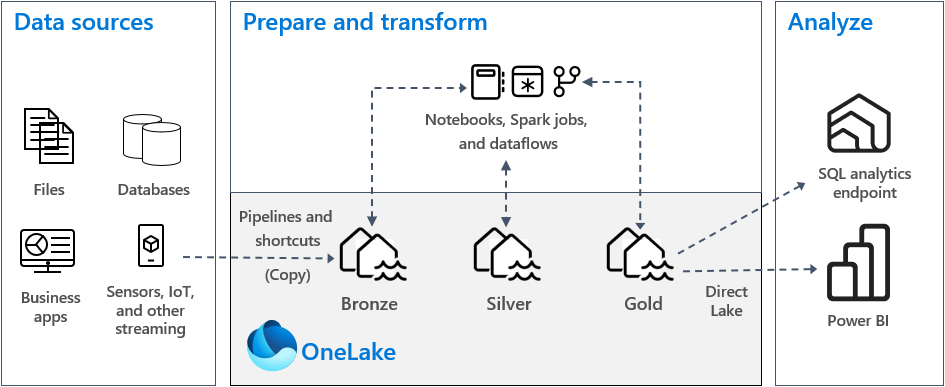

# Introduction

Microsoft Fabric is a data platform build for the era of AI that can reshape how our customers work with data by bringing everyone together on a single AI-powered, platform built for the era of AI. Fabric combines the best of Microsoft Power BI, Azure Synapse Analytics, and Azure Data Factory to create a single, unified software as a service (SaaS) platform with seven core workloads—each purpose-built for specific personas and specific tasks. By creating a single platform with tools for every data professional in a unified experience and architecture, it can reduce the typical cost and effort of integrating analytics services and help simplify our customers data estate. This unified architecture also simplifies governing and securing data and billing with a single pool of capacity and storage that can be used for every workload.

All the code in this tutorial can be found here:   
[ADX Analytics github repo](<https://github.com/eshalmiev/fabric-workshop>)  

Built by:   
**Emanuel Shalmiev**   
**SR Technical Specialist @Microsoft**   

---

# Workspace Management in Microsoft Fabric

## Introducing data Domains

Merging all data workloads into one environment necessitates better governance and access management due to increased users and artifacts. 
Part of the solution that, Microsoft has introduced Domains, allowing for the organization and management of data by grouping multiple workspaces. 
This shift reflects organizations moving away from traditional IT-centric data architectures towards more federated models aligned with business needs. 

Microsoft recommends organizing data into separate Domains for each department within a Data Mesh architecture, empowering departments with ownership and responsibility for their data. 

All workspaces related to a specific department can be grouped under the same Domain, facilitating decentralized data management.

## Implement medallion architecture

* [Implement medallion lakehouse architecture in Microsoft Fabric](<https://learn.microsoft.com/en-us/fabric/onelake/onelake-medallion-lakehouse-architecture>)   

The goal of medallion architecture is to incrementally and progressively improve the structure and quality of data as it progresses through each stage.

**Bronze**: Also known as the raw zone, this first layer stores source data in its original format. The data in this layer is typically append-only and immutable.

**Silver**: Also known as the enriched zone, this layer stores data sourced from the bronze layer. 
  * Cleanin data                            
  * Enriching Data
  * Combining datasets
  * Partitiong data
  * Applying data types
  * Stored in more structure queryable format

**Gold**: Also known as the curated zone, this final layer stores data sourced from the silver layer. The data is refined to meet specific downstream business and analytics requirements. Tables typically conform to star schema design, which supports the development of data models that are optimized for performance and usability.

* Create Gold zone in lakehouse. In this case, business users access data by using the **SQL analytics endpoint**.
* Create Gold zone as data warehouse. In this case, business users access data by using the **DataWarehouse endpoint**.

For example, this solution enables us to segregate our data layers, thereby simplifying data analysis while operating within the same workspace. Moreover, it facilitates better access management for each Lakehouse, ensuring that analysts do not have access to our Bronze layer.

---

# Ingest data into LAKEHOUSE

Shortcuts allow you to create a virtualized data lake, eliminating copies of data between organization domain, analytical engines or Cloudes.

## Load data from Shortcut ADLS Gen2
  
Sometimes, we may want to establish a separate area unrelated to the Bronze layer, acting as a Landing Zone. From this zone, data can then be transferred to the Bronze layer.

**Create LandingZone Lakehouse**

**Create Shortcut**

**Load data from LandingZone to Bronze with notebook**

## Load data from Blob storage to Bronze with notebook

## Read data from streams

With Eventstream, we can read data from streaming sources like EventHub and store it in a KQL Database or Lakehouse.

---

# Create Private Endpoints

* [Create and use managed private endpoints in Microsoft Fabric](<https://learn.microsoft.com/en-us/fabric/security/security-managed-private-endpoints-create>)   

Users with admin permissions to a Microsoft Fabric workspace can create, view, and delete managed private endpoints from the Fabric portal through the workspace settings.
In a Fabric workspace, navigate to the workspace → Workspace settings → Network security → Create 
Get Resource identifier  from Azure portal → Resource group → SQL server → Properties → Resource ID (started with /subscriptions/)

---

# Security in Microsoft Fabric